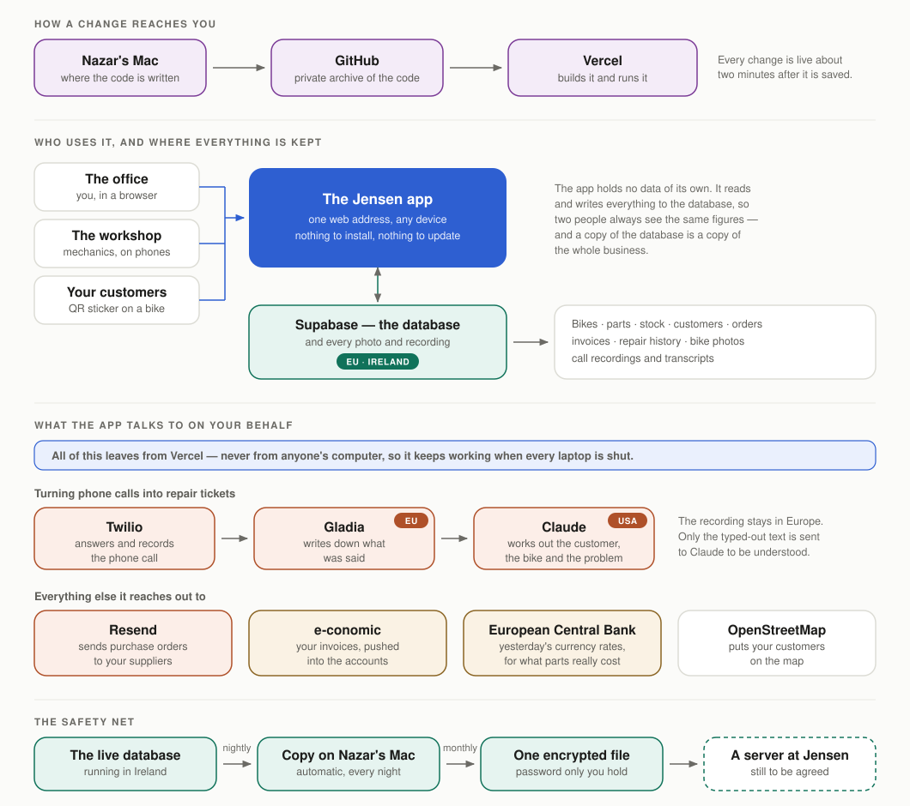
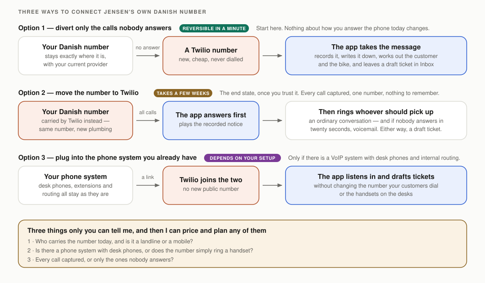

# What the system is made of, and what it costs to run

For Dennis. Every moving part behind the app — where your data lives, what talks
to what, and what the whole thing costs a month.

You do not need any of this to use the app. It matters for three reasons: it is
your business running on it, you are paying for it, and one day somebody other
than me may need to look after it. So it is written to be read once and kept.

---

## The whole picture on one page

Four things are worth taking from that picture.

**The app itself holds nothing.** It is a program that runs on rented computers
and reads and writes everything to the database. That is why two people always
see the same stock figure, and why there is nothing to install, back up or
update on any machine at Jensen.

**Everything your business knows sits in one database, in Ireland.** Bikes,
parts, stock, customers, orders, invoices, repair history, bike photos, call
recordings. A copy of that database is a copy of the business — which is what
makes the backup question — where your own copy should live — worth five
minutes of your thinking.

**The app reaches out on your behalf, not from anyone's laptop.** Purchase
orders to suppliers, invoices to your accounts, currency rates, phone calls. All
of it leaves from the rented computers, so it keeps working at 3 a.m. with every
machine at the workshop switched off.

**Nothing in the chain is exotic or homemade.** Each box is an ordinary service
that thousands of companies use, chosen so it can be replaced. If any one
supplier became a problem, that box comes out and another goes in without
rebuilding the rest.

---

## The pieces, in plain terms

### Building it and putting it live

**GitHub** keeps every version of the code, privately. Not just today's — every
change ever made, with the reason for it. If my laptop went in the harbour
tomorrow, nothing would be lost.

**Vercel** takes that code and runs it as the website you log in to. When I fix
something, I save it and Vercel has it live about two minutes later. There is no
"deployment evening" and no downtime.

### Where the data lives

**Supabase** is the database and the file store, running in Ireland — inside the
EU, which is what keeps the recording and customer side of this straightforward
under GDPR. It holds the records and the files: every bike photo, every call
recording, every generated PDF.

### What the app talks to

**Twilio** is the telephone company part. It answers the workshop number, plays
the recorded-call notice, rings a real mobile and records the conversation. The
next section is about connecting your own number to this.

**Gladia** turns a recording into text. It runs in the EU, so the audio never
leaves Europe.

**Claude** reads that text and works out who was calling, which bike they meant
and what they wanted, then drafts a ticket. This is the one piece that runs in
the United States, and only the typed-out text is sent — never the audio, never
your database.

**Resend** sends the emails the app writes: purchase orders to your suppliers,
paint orders to your painter, and invoice mail later on.

**e-conomic** is your own accounting system. The app pushes finished invoices
into it so nobody types an invoice twice.

**The European Central Bank** provides the official daily currency rates, so
when you buy in dollars or euros the app knows what the parts really cost in
kroner — and freezes that rate onto the purchase so history stays truthful.

**OpenStreetMap** turns customer addresses into map pins.

### If one of these ever has to change

Each of those is behind a plug rather than welded in, and that is not a promise —
it is already true in one case: there is a **second transcription service
built and ready to use** alongside the one running today, because I did not want
that box to have a single supplier.

The one worth knowing about concerns Europe. **Claude, in the United States, is
the only piece of this anywhere outside the EU**, and only the typed-out text
reaches it — never the recording, never your database. If that ever became a
problem — a hospital or municipal tender with data-residency conditions, or your
own advisers asking the question — there is a French service that does the same
job, and moving to it would make the entire chain European.

I am not proposing that. Today's arrangement is lawful and normal, and the
French option is not as good at the job. It is worth knowing the door exists,
given who your customers are.

The honest version of all this: replaceable is not the same as interchangeable.
Swapping one of these boxes is a day or two of my work, not a setting somebody
ticks. What it does mean is that no supplier here can put a gun to your head.

### The safety net

Every night a complete copy of the database and its files is pulled down
automatically. Once a month that becomes a single encrypted file, which is the
copy meant to live on hardware of yours. Still to be decided together: where it
should live, and rehearsing a restore so you have seen one work rather than been
told it does.

---

## Connecting your own Danish number

Today the app answers an American test number, which is fine for testing and
useless in practice. Your customers ring a Danish number that you already own.
There are three ways to join the two, and they differ mostly in how reversible
they are.

**Option 1 — divert only the calls nobody answers.** Your number stays with your
current provider, exactly as it is. You ask them to divert to a new Twilio
number *only when nobody picks up*. Calls you answer are untouched and the app
never sees them; calls you miss become recordings, transcripts and draft
tickets. This needs no paperwork, costs a few kroner a month, and is undone in a
minute by turning the divert off. **This is where I would start**, because it
gets you the useful half of the feature with nothing at risk.

**Option 2 — move the number to Twilio.** Your number keeps its digits but
Twilio becomes the carrier. Then every call runs through the app: the notice
plays, your mobile rings, you talk normally, and the conversation is recorded
and drafted into a ticket. This is the version worth having in the end. It is
also the one with real commitment — porting a Danish number takes a few weeks
and paperwork with your current provider, and moving it back would take as long.
Worth doing once you have watched Option 1 work for a while.

**Option 3 — plug into a phone system you already have.** If Jensen runs a VoIP
system with desk phones and internal routing, Twilio can connect to it directly.
Your public number and your handsets stay exactly as they are, and the app
listens alongside. This is the most flexible route and the least predictable,
because it depends entirely on what equipment is actually there.

**What I would need from you to price and plan any of these:**

1. Who carries the number today, and is it a landline or a mobile?
2. Is there a phone system with desk phones, or does the number simply ring a
   handset?
3. Do you want every call captured, or only the ones nobody answers?

Answer those three and I can put a firm plan and a firm number against whichever
one you prefer.

---

## What it costs to run

Two honest categories here, because they behave differently. Some of these are
fixed subscriptions I can quote exactly. The telephone side depends on how many
calls you get and how long they last, so it is a range until we have a month of
real traffic.

Converted at the rate on my August statement, about 6.55 kr. to the dollar.

### The fixed part — quotable today

| What | Why it is needed | Per month |
|---|---|---|
| Supabase (database + files) | Where the business lives. Paid tier, for nightly backups and support | **164 kr.** ($25) |
| Vercel (running the app) | Runs the website. The commercial tier is required — Jensen is a business, and the free tier is licensed for hobby use only | **131 kr.** ($20) |
| GitHub (code archive) | Private code history. Free, permanently — this is not a trial | **0 kr.** |
| Resend (supplier email) | Sends purchase and paint orders. Free allowance, see below | **0 kr.** |
| Domain name | Annual, roughly 150 kr./year | **~13 kr.** |
| | **Fixed total** | **~310 kr./month** |

### The variable part — telephone and transcription

This is the part that scales with use. The figures below assume something like
200 calls a month averaging three minutes, which is a guess I would rather
replace with a real month's data.

| What | How it is charged | Estimate |
|---|---|---|
| Twilio — Danish number | Monthly rental | ~15 kr. |
| Twilio — call minutes | Per minute in, plus per minute forwarding to a mobile | ~165–260 kr. |
| Gladia — transcription | Per minute of audio. Free allowance today, see below | ~40 kr. |
| Claude — understanding the call | Per call, on the text only | ~10–30 kr. |
| | **Variable total** | **~230–350 kr./month** |

### What is free today — and where that ends

Two pieces have never appeared on a bill, and it is worth being straight about
why, because "free" is doing different work in each case.

**GitHub is genuinely free and will stay that way.** Private code storage costs
nothing at this scale. Nothing to plan for.

**Resend is free within an allowance** measured in thousands of emails a month.
You send purchase and paint orders, not newsletters, so the allowance is unlikely to be a
problem — but if invoice mail is added later the volume goes up, and the paid
tier is about 131 kr. ($20) a month if it ever comes to that.

**Gladia is the one to watch.** Transcription has cost nothing so far because
testing has stayed inside a free starting allowance. That allowance is not a
plan — real call traffic will pass through it, and at that point transcription
becomes a genuine per-minute cost. It is small (the ~40 kr. above), but it goes
from zero to something the first month your own number is connected. I will
confirm the exact allowance and rate before we connect anything, so this arrives
as a number you already knew about rather than a surprise.

None of the three changes the shape of the total. I am flagging them because a
cost that appears from nowhere three months in is the kind of thing that makes
you wonder what else you were not told.

### Altogether

**Roughly 550–650 kr. a month, or 6,500–7,800 kr. a year**, to run the whole
thing including the phone pipeline. Without the phone features it is about
310 kr. a month.

For context, that is less than the cost of the paper, printing and duplicated
typing it replaces — but I would rather you judged that than took my word for
it.

### Things that are deliberately not on this list

- **e-conomic** — you already pay for it. The integration adds nothing to that
  bill.
- **A server or NAS for your own backup copy** — a one-off purchase if you decide
  you want one, not a subscription. To be discussed at a check-in.
- **Porting your phone number**, if you choose Option 2 — a one-off fee from
  your current provider, usually modest.
- **My time.** This document is about what the machinery costs, not what
  building or looking after it costs.

---

## Two things worth knowing before you sign up to any of it

**Everything above is rented, monthly, and in my name today.** Not one of these
services has a long contract — the longest commitment in the whole list is a
month. That is deliberate: it means nothing here traps you. It also means the
accounts themselves need to end up somewhere sensible, which is a conversation
better had face to face than in a document.

**The variable estimate is the honest weak point.** I can quote Supabase and
Vercel to the krone because they are flat subscriptions. The telephone numbers
are arithmetic on an assumed call volume, and assumed call volumes are usually
wrong. One real month on your own number turns that range into a figure, which
is another reason to start with Option 1.

---

*Written 17 August 2026, against version 0.11.0 of the app.*
