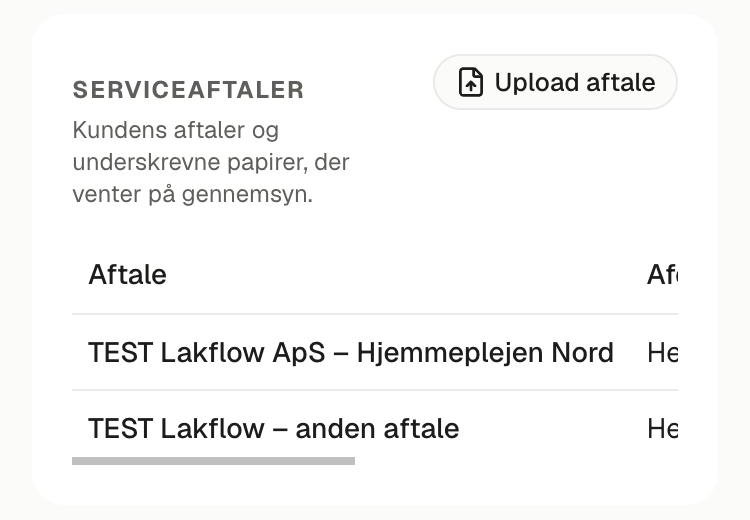
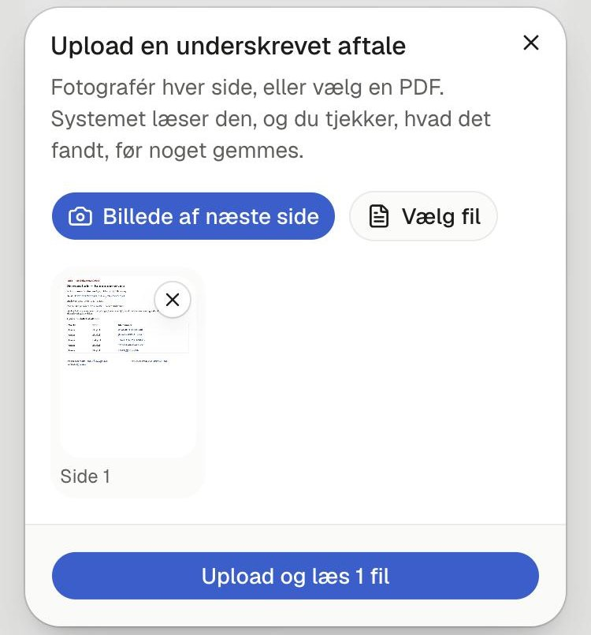
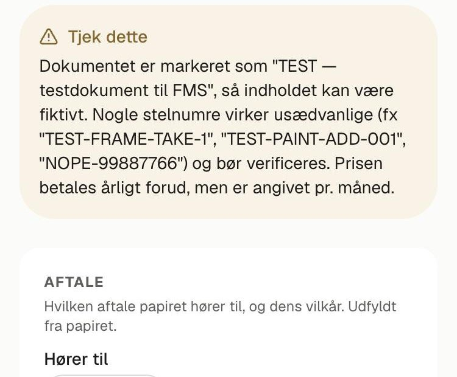
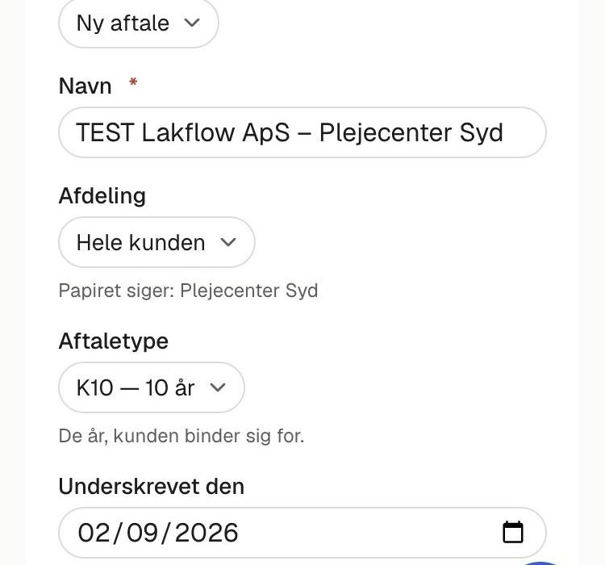
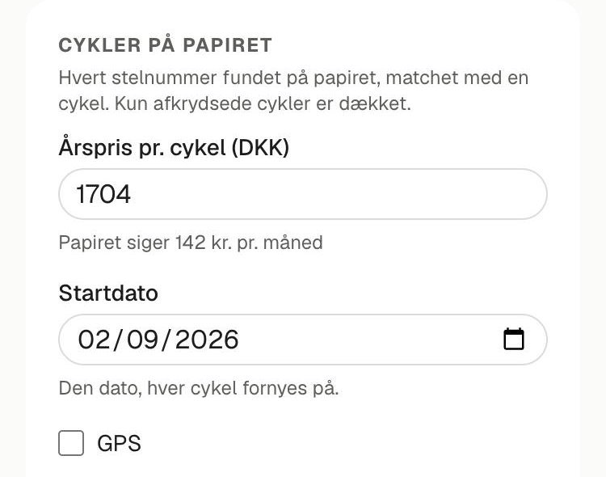
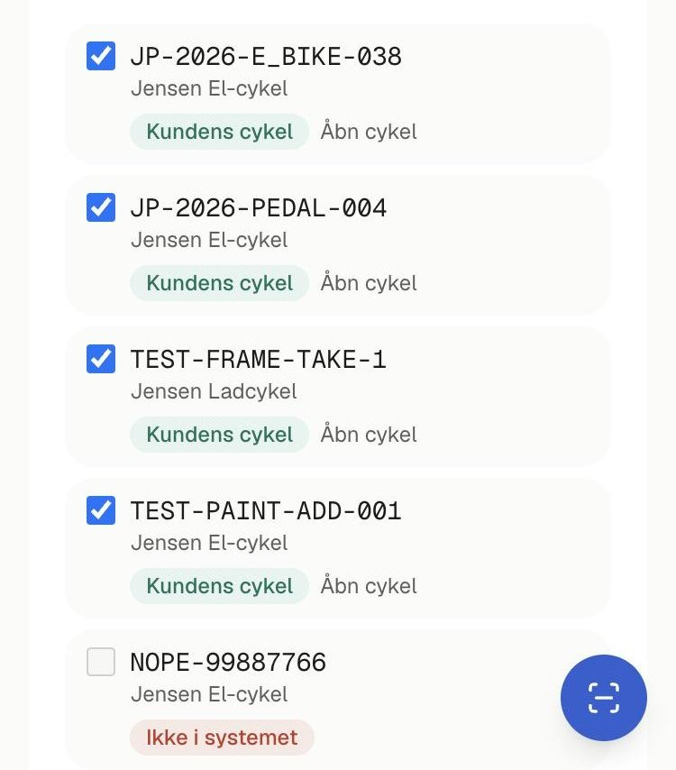
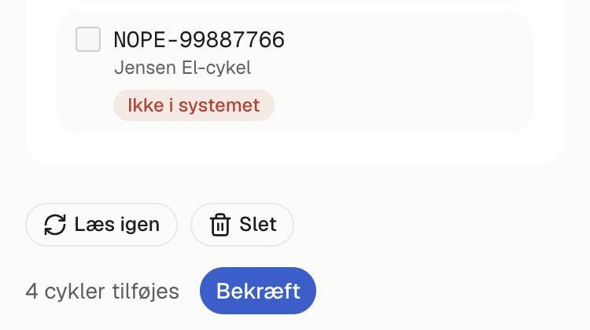
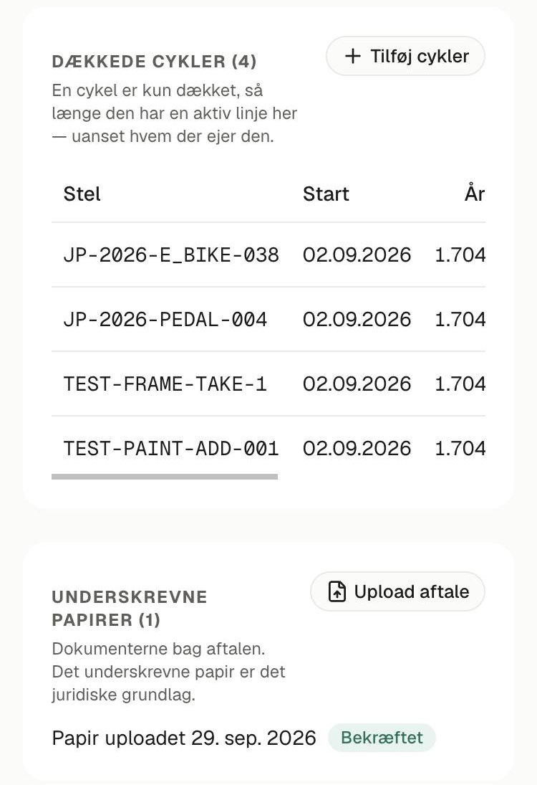

# Serviceaftaler i Jensen FMS — upload en underskrevet aftale

**Til Dennis, september 2026.** Sådan kommer en underskrevet serviceaftale ind i
systemet fra din telefon. Du tager et billede af hver side, systemet læser
aftalen og finder stelnumrene, og du bekræfter, hvilke cykler den dækker.
**Intet gemmes, før du trykker *Bekræft*.**

**Derfor betyder det noget:** en cykel er nu kun dækket, når den står på en
aftale. En reparation på en dækket cykel faktureres ikke. Alle andre
reparationer faktureres.

## Fem trin

| Trin | Hvad du gør |
|---|---|
| **1 · Find kunden** | *Kunder → Alle kunder*, åbn kunden, rul ned til **Serviceaftaler** |
| **2 · Fotografér** | **Upload aftale → Tag billede**, én side ad gangen |
| **3 · Upload** | **Upload og læs**. Systemet læser siderne, op til et minut |
| **4 · Tjek** | Aftalen og cyklerne er udfyldt fra papiret. Ret det, der er forkert |
| **5 · Bekræft** | **Bekræft**. Cyklerne er dækket |

## 1 · Find kunden

1. Åbn menuen → **Kunder → Alle kunder**, og åbn kunden (fx Gladsaxe Kommune).
2. Rul ned til **Serviceaftaler**. Her står kundens aftaler og de papirer, der
   venter på dig.
3. Tryk **Upload aftale**.

Står du allerede på en aftale (*Serviceaftaler →* aftalen), kan du trykke
**Upload aftale** dér. Så hører papiret til den aftale fra start.

## 2 · Tag et billede af hver side

1. Tryk **Tag billede**. Kameraet åbner.
2. Fotografér første side: papiret fladt på bordet, telefonen lige over det,
   godt lys, hele siden med.
3. Tryk **Billede af næste side** for hver ny side. Husk siden med
   **stelnumrene** og siden med **underskrifterne**.
4. Blev et billede dårligt? Tryk **✕** på det, og tag det igen.

Har du aftalen som PDF, fx i en mail? Tryk **Vælg fil** i stedet. En Word-fil
skal først gemmes som PDF.

## 3 · Upload og læs

Tryk **Upload og læs**. Siden skifter til *Underskrevet papir*, og systemet
læser siderne. Det tager op til et minut. Lukker du siden undervejs, læses
papiret, næste gang du åbner det.

## 4 · Tjek forslaget

Øverst står papiret, og under det står, hvad systemet fandt. **Tjek hvert felt
mod papiret.**

- Den gule boks **Tjek dette** fortæller, hvad systemet var i tvivl om:
  håndskrift, noget der er streget ud, en side der ser ud til at mangle.
- **Hører til:** hvilken af kundens aftaler papiret hører til. Systemet
  foreslår selv. Står der **Ny aftale**, oprettes en ny, når du bekræfter. Giv
  den et navn som *kunde – afdeling*.
- **Aftaletype:** K1, K3, K5 eller K10, altså de år, kunden binder sig for. Står
  der ingen type på papiret, så lad feltet stå på *Ikke angivet*.
- **Underskrevet den / af:** datoen og navnene ved underskrifterne.

### Cyklerne på papiret

- **Årspris pr. cykel:** normalt 1 704 kr. Står prisen pr. måned på papiret,
  ganger systemet selv med 12. Ligner prisen stadig en månedspris, står det
  med rødt under feltet.
- **Startdato:** den dag, cyklerne fornyes hvert år. Normalt datoen for
  underskriften. Ret den, hvis cyklerne blev leveret en anden dag.
- **GPS:** sæt flueben, hvis cyklerne har GPS.

Hvert stelnummer på papiret står på sin egen linje med et mærke:

| Mærke | Betyder | Flueben |
|---|---|---|
| **Kundens cykel** | Cyklen findes og tilhører kunden | Sat af sig selv |
| **På** *en anden aftale* | Cyklen er allerede dækket af en anden aftale | Sæt det selv for at flytte cyklen hertil |
| **Allerede på denne aftale** | Cyklen er dækket i forvejen | Ikke nødvendigt |
| **Tilhører** *en anden kunde* | Cyklen står på en anden kunde | Tjek først, hvem der ejer den |
| **Cykel uden kunde** | Cyklen findes, men har ingen kunde endnu | Sæt det, hvis det er den rigtige |
| **Ikke i systemet** | Stelnummeret findes ikke | Kan ikke vælges |

Står der **Mente du…** ved et stelnummer, har systemet fundet en cykel, der
næsten passer, fx hvis et O er læst som et 0. Vælg den, hvis det er den rigtige.

## 5 · Bekræft

Nederst står, hvor mange cykler der tilføjes. Tryk **Bekræft**.

Du kommer til aftalen. Cyklerne står under **Dækkede cykler**, og papiret ligger
under **Underskrevne papirer**, markeret *Bekræftet*.

## Bagefter

- **Mangler en cykel?** På aftalen: **Tilføj cykler**, sæt flueben, **Tilføj**.
- **Skal en cykel ud (stjålet, kasseret, opsagt)?** Tryk **Afslut** ved cyklen,
  og vælg årsag og dato. Der krediteres ikke noget af sig selv.
- **Forkert papir, eller uploadet to gange?** Tryk **Slet** på papiret, før du
  bekræfter. Et bekræftet papir bliver liggende.
- **Kunne papiret ikke læses?** Tryk **Læs igen**. Hjælper det ikke, så slet
  papiret og tag skarpere billeder, eller udfyld felterne selv. Du kan godt
  bekræfte uden en læsning.

## Godt at vide

- **Systemet foreslår, du bestemmer.** Intet gemmes, før du trykker *Bekræft*.
- **Papiret gemmes** og kan altid åbnes igen fra aftalen. Det er det juridiske
  grundlag.
- **En cykel kan kun stå på én aftale ad gangen.**
- **Prisen fryses på hver cykel.** En senere prisændring rører ikke de cykler,
  der allerede står på aftalen.
- **Fornyelsesfakturaerne laver systemet ikke endnu.** Det er næste trin. Indtil
  da fakturerer du som hidtil.
