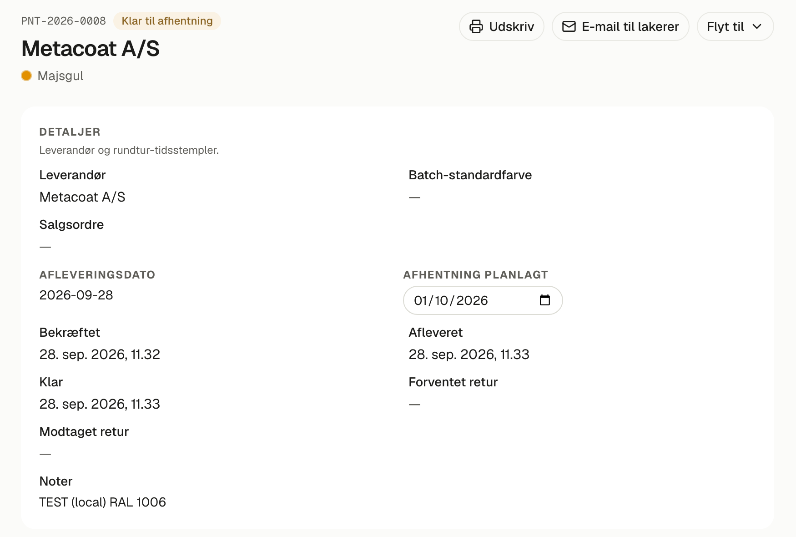
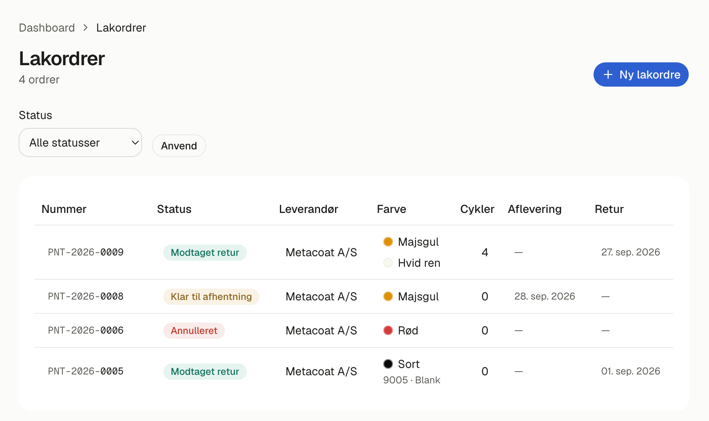

# Lakordrer i Jensen FMS — din vejledning

**Til Dennis, september 2026.** Sådan sender du dele til lakereren og får dem
tilbage, fra salgsordren til lakeret lager. Systemet skelner nu mellem
**papiret** (ordren er sendt til lakereren) og **varerne** (kasserne er kørt
derud). Emailen fryser priserne, men kasserne tæller først som *hos lakerer*
den dag, Finn kører dem.

## Forløbet

| Status | Hvad sker der | Hvem |
|---|---|---|
| **Planlagt** | Ordren bygges op. Linjer og priser kan stadig ændres. | Dig |
| **Bekræftet** | Du trykker *E-mail til lakerer*. Priserne fryses, og lakereren får ordren. **Varerne er stadig her.** | Dig |
| **Hos lakerer** | Skifter **af sig selv om morgenen på afleveringsdatoen**, den dag Finn kører. Cyklerne kan ikke bygges, mens delene er væk. | Automatisk / Finn |
| **Klar til afhentning** | Lakereren har sagt, at det er færdigt. Sæt *Afhentning planlagt*, så alle kan se dagen. | Dig / Finn |
| **Modtaget retur** | Kasserne er hjemme. De lakerede dele kommer på lakhylden som lager. | Dig / Finn |

## 1 · Opret lakordren fra salgsordren

1. Åbn salgsordren. Cyklerne skal have en produktionsordre først; systemet
   spørger selv, når den sidste er oprettet.
2. Vælg **Send til lakering**. Linjerne kommer fra opskriften, **hver cykel i
   sin egen farve**, og alle kundens dele samles i **én** lakordre.
3. Sæt **Afleveringsdato hos lakereren**, den dag Finn kører kasserne derud.

## 2 · Send ordren: e-mail til lakerer

På lakordren trykker du **E-mail til lakerer**. Så sker to ting på én gang:

- lakereren får ordren som dokument, på sit eget sprog;
- ordren bliver **Bekræftet**, og priserne fryses på hver linje.

Ordren står stadig på værkstedet. Den tæller ikke som *hos lakerer* endnu, så
et stel, der venter, er ikke "væk".

## 3 · Afleveringsdagen: det sker af sig selv

Om morgenen på afleveringsdatoen skifter ordren til **Hos lakerer**. Du skal
ikke gøre noget.

- **Rykker turen?** Flyt *Afleveringsdato* på ordren. Den kan ændres, indtil
  varerne er afleveret.
- **Kører Finn tidligere?** Brug **Flyt til → Hos lakerer** med det samme.

## 4 · Klar til afhentning

Når lakereren siger, at ordren er færdig: **Flyt til → Klar til afhentning**,
og sæt **Afhentning planlagt** til den dag, Finn henter. Datoen står på ordren
for alle.

## 5 · Modtaget retur

Når kasserne er hjemme: **Flyt til → Modtaget retur**. Hver linje, der
nævner en del og en farve, bliver til **lakeret lager** og står på
*Lakhylde*. Mangler en linje del eller farve, spørger systemet, før det
fortsætter. Så kan du rette linjen eller modtage alligevel.

## Oversigten

*Ordrer → Lakordrer* viser alle ordrer med status, afleveringsdato (planlagt,
indtil den er sket) og returdato. Filtrér på status for at se, hvad der er ude
lige nu.

## Godt at vide

- **Finn kører turene fra sin telefon** under *Værkstedet → Lakture*: han ser,
  hvad der er i kasserne (uden priser), trykker *Afleveret nu*, *Lakereren siger,
  den er klar* og *Hentet*, og kan flytte afleverings- og afhentningsdatoen.
  Mangler en linje del eller farve, når han henter, får du en e-mail om, hvilken
  ordre der skal rettes.
- **Kasse-etiketter med QR** kommer, når vi kender din etiketprinter. Så kan
  pakning og modtagelse ske med en scanning.
- **Noget virker ikke?** Ring til Nazar.
