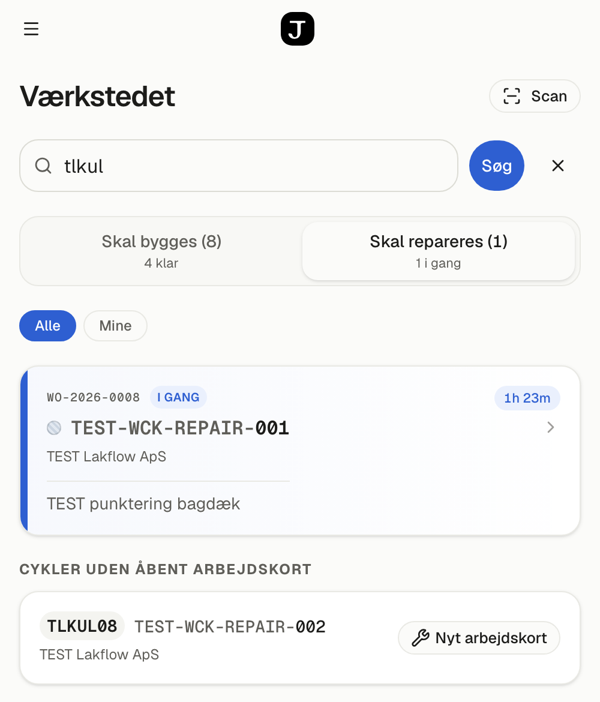
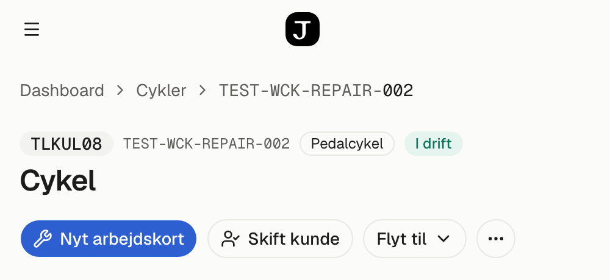
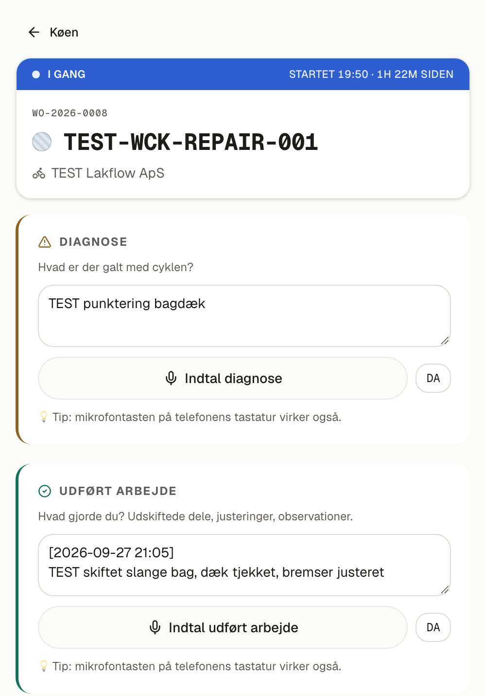
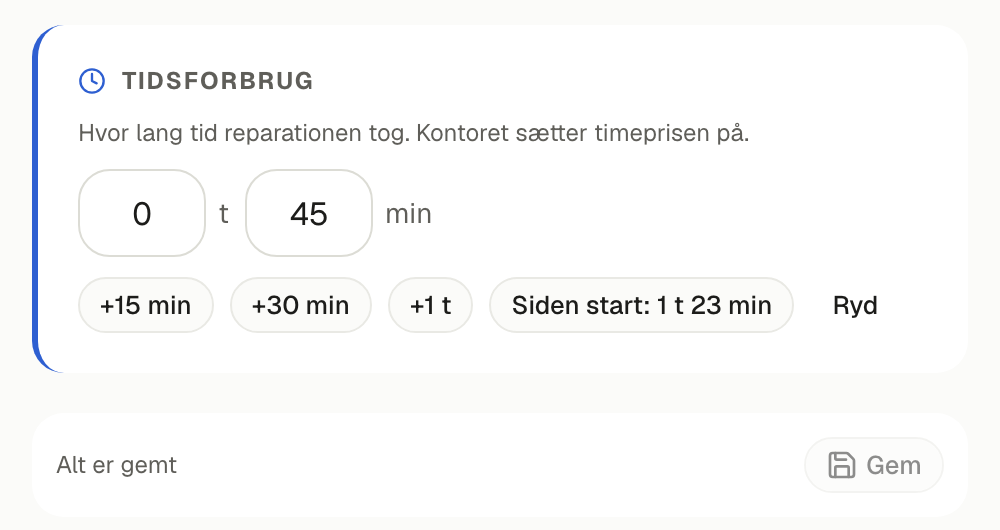
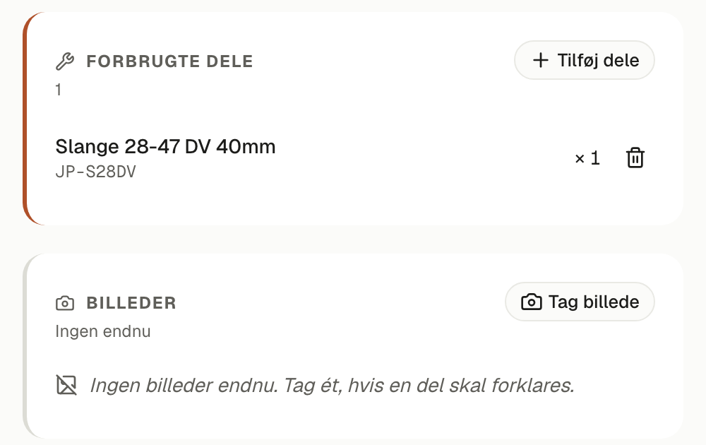
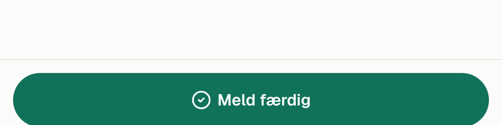
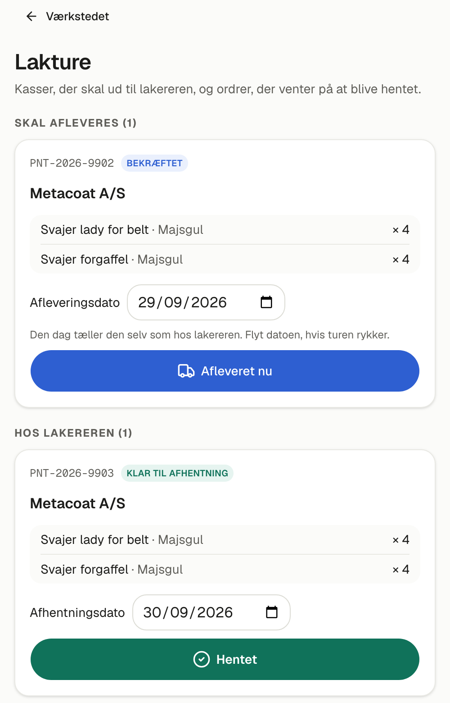

# Reparationer i Jensen FMS — din vejledning

**Til Finn, september 2026.** Sådan registrerer du en reparation fra
telefonen: find cyklen, opret et arbejdskort, skriv eller indtal hvad du gør,
og meld færdig. Afsnit 8 viser lakturene — kasser til og fra lakereren. Kontoret sætter priserne på bagefter — du ser ingen priser, og det er
meningen. Vi går det igennem sammen på tirsdag.

## 1 · Log ind

1. Åbn **jensen-fms.vercel.app** på telefonen. Tip: tilføj siden til
   hjemmeskærmen, så den åbner som en app.
2. Vælg **dit navn** og skriv **din adgangskode**. Den får du på tirsdag.
3. Du lander på **Værkstedet**. I menuen (☰) har du *Cykler*, *Dele* og
   *Arbejde* — mere skal du ikke bruge.

## 2 · Find cyklen

Der er to veje. Brug den, der er nemmest:

- **Scan** — tryk *Scan* og peg kameraet mod QR-mærkaten på cyklen.
- **Søg** — skriv i søgefeltet på *Værkstedet* og tryk *Søg*. Du kan søge på
  - **koden på cyklens mærkat**, fx *BKTM01*. Den kan skrives, som kunden siger
    den: *»bktm 1«* finder også BKTM01;
  - en del af **stelnummeret**;
  - **kundens navn**, fx *Kolding*;
  - **arbejdskortets nummer**, fx *WO-2026-0008*.

Øverst står cykler, der allerede har et **åbent arbejdskort**. Tryk på kortet
for at fortsætte på det. Nedenunder står **cykler uden åbent arbejdskort**.

## 3 · Opret arbejdskortet

Tryk **Nyt arbejdskort** — enten i søgeresultatet eller øverst på cyklens side,
hvor du lander efter en scanning. Arbejdskortet åbner med det samme.

Har cyklen allerede et åbent arbejdskort, står der **Åbn WO-…** i stedet, og du
kommer til det. Systemet laver ikke to kort til samme cykel.

## 4 · Arbejd på cyklen

Tryk **Start arbejdet** nederst, når du går i gang. Så starter uret, og båndet
øverst bliver blåt og viser, hvornår du startede.

- **Diagnose** — hvad er der galt med cyklen?
- **Udført arbejde** — hvad gjorde du?

Du kan skrive, eller trykke **Indtal …** og sige det. Teksten dukker op med
klokkeslæt foran, så hver indtaling bliver sin egen linje. Mikrofonen på
telefonens tastatur virker også.

## 5 · Tidsforbrug

Skriv, hvor lang tid reparationen tog: **timer** og **minutter**. Du behøver
ikke taste:

- **+15 min**, **+30 min** og **+1 t** lægger tid til;
- **Siden start** sætter tiden, der er gået, siden du trykkede *Start arbejdet*;
- **Ryd** tømmer feltet.

Tryk **Gem**. Der står *Ugemte ændringer*, indtil du har gemt.

## 6 · Dele og billeder

- **Tilføj dele** — vælg de dele, du faktisk brugte. De trækkes fra lageret
  med det samme. Har du taget fejl, fjerner du delen med skraldespanden.
- **Tag billede** — hvis noget skal forklares, fx en knækket del.

## 7 · Meld færdig

Tryk **Meld færdig** nederst. Systemet spørger en gang til og viser det
tidsforbrug, du har registreret. Står der, at der ikke er registreret noget,
så tryk *Annullér* og udfyld det først. Tryk **Bekræft — afslut**.

Et afsluttet arbejdskort kan **ikke åbnes igen**. Skal der laves mere på
cyklen, opretter du et nyt.

## 8 · Lakture: til og fra lakereren

Når du kører kasser ud til lakereren eller henter dem, bruger du **Lakture**
øverst på *Værkstedet*. Tallet viser, hvor mange ordrer der venter. Du ser,
hvad der er i kasserne, og hvor de skal hen, men ingen priser.

**Skal afleveres**: ordrer, kontoret har sendt til lakereren.

- På **afleveringsdatoen** tæller ordren af sig selv som *hos lakereren*. Du
  skal ikke gøre noget.
- **Kører du en anden dag?** Flyt **Afleveringsdato**.
- **Kører du tidligere?** Tryk **Afleveret nu**, når kasserne er afleveret.

**Hos lakereren**: ordrer, der er derude.

- Siger lakereren til dig, at den er færdig, så tryk **Lakereren siger, den er
  klar**.
- Sæt **Afhentningsdato** til den dag, du henter. Så kan alle se den.
- Når kasserne er hjemme, tryk **Hentet** og derefter **Ja — hentet**. De
  lakerede dele kommer på lakhylden. Mangler der noget på ordren, får Dennis
  besked. Du skal ikke rette noget.

## Godt at vide

- **Du ser ingen priser** — hverken på dele eller timer. Kontoret sætter
  timeprisen på og laver fakturaen.
- **Kan du ikke finde cyklen?** Den er måske ikke lagt ind endnu. Skriv
  stelnummer og kundens navn ned, og giv dem til Dennis.
- **Noget virker ikke?** Ring til Nazar.
