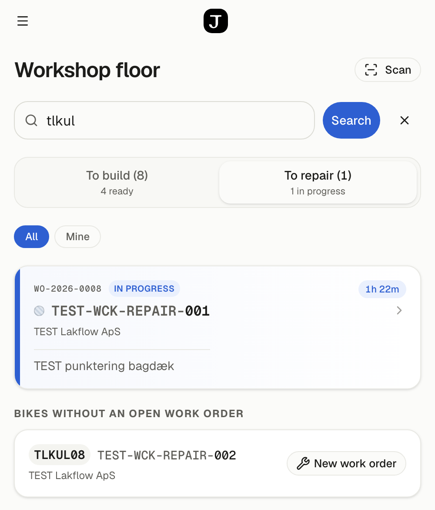
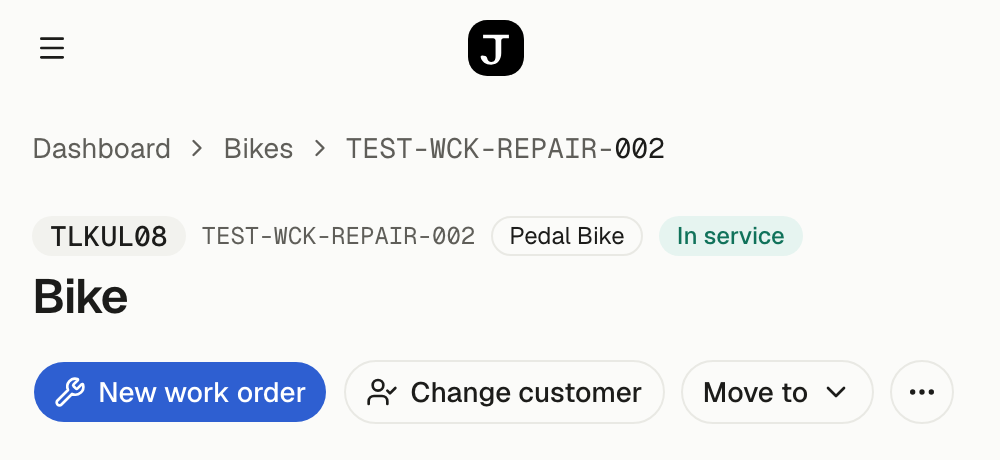
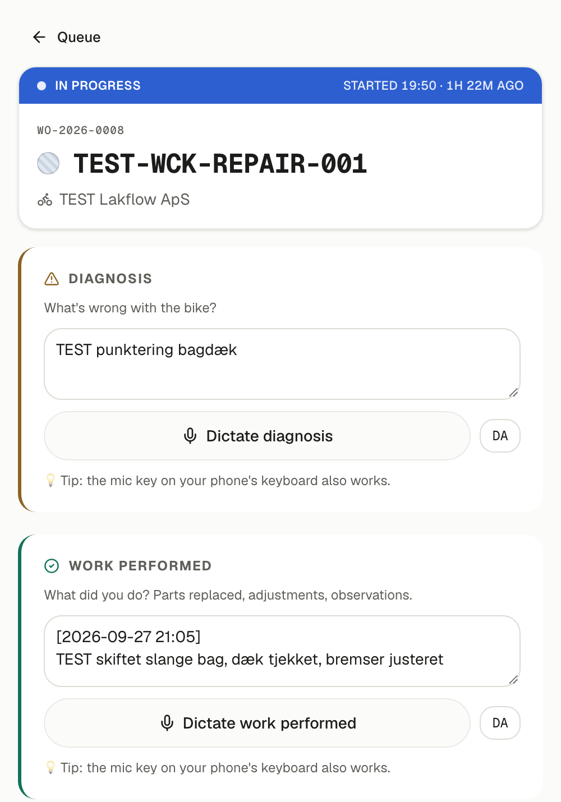
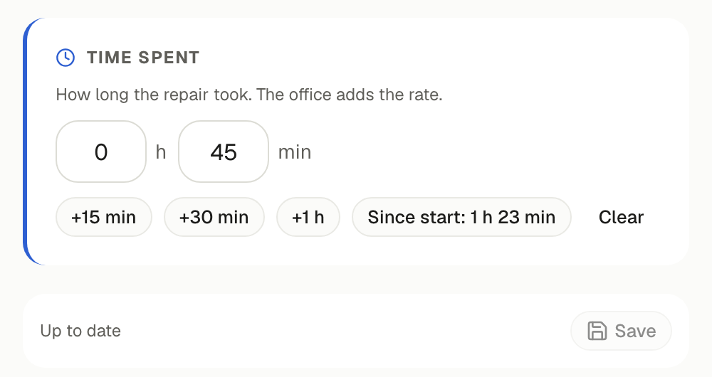
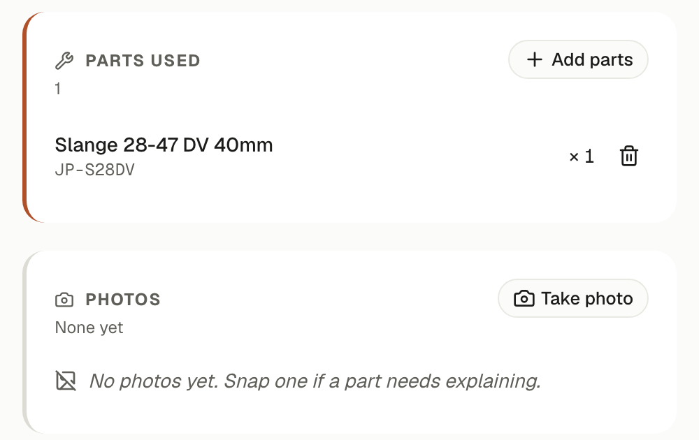
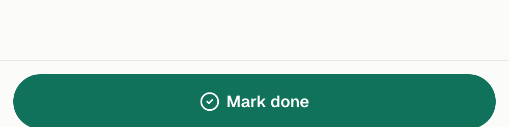

# Repairs in Jensen FMS — your guide

**For Finn, September 2026.** How to record a repair from your phone: find the
bike, start a work order, write or dictate what you do, and mark it done. The
office adds the prices afterwards. You see no prices, and that is intended.
We will go through it together on Tuesday.

*The Danish version is the one to use; this English copy shows the same
screens in English.*

## 1 · Sign in

1. Open **jensen-fms.vercel.app** on your phone. Tip: add it to the home
   screen so it opens like an app.
2. Pick **your name** and type **your password**. You get it on Tuesday.
3. You land on the **Workshop floor**. The menu (☰) has *Bikes*, *Parts* and
   *Work*. That is all you need.

## 2 · Find the bike

There are two ways. Use whichever is quicker:

- **Scan**: tap *Scan* and point the camera at the QR sticker on the bike.
- **Search**: type in the search box on the *Workshop floor* and tap
  *Search*. You can search by
  - **the code on the bike's label**, e.g. *BKTM01*. You can type it the way
    the customer says it: *"bktm 1"* also finds BKTM01;
  - part of the **frame number**;
  - **the customer's name**, e.g. *Kolding*;
  - **the work order number**, e.g. *WO-2026-0008*.

Bikes that already have an **open work order** are listed at the top. Tap the
card to carry on with it. Below them are **bikes without an open work
order**.

## 3 · Start the work order

Tap **New work order**. It is in the search result, and at the top of the
bike's page, where a scan takes you. The work order opens straight away.

If the bike already has an open work order, the button reads **Open WO-…**
instead and takes you to that one. The system never makes two for one bike.

## 4 · Work on the bike

Tap **Start work** at the bottom when you begin. The clock starts, and the
band at the top turns blue and shows when you started.

- **Diagnosis**: what is wrong with the bike?
- **Work performed**: what did you do?

Type it, or tap **Dictate …** and say it. The text appears with the time in
front, so each dictation becomes its own entry. The microphone key on the
phone's keyboard works too.

## 5 · Time spent

Enter how long the repair took, in **hours** and **minutes**. You don't have
to type:

- **+15 min**, **+30 min** and **+1 h** add time;
- **Since start** fills in the time since you tapped *Start work*;
- **Clear** empties the field.

Tap **Save**. It says *Unsaved changes* until you do.

## 6 · Parts and photos

- **Add parts**: pick the parts you actually used. They come off the stock
  count straight away. If you picked the wrong one, remove it with the bin.
- **Take photo**: when something needs explaining, e.g. a broken part.

## 7 · Mark done

Tap **Mark done** at the bottom. The system asks once more and shows the time
you recorded. If it says no time is recorded, tap *Cancel* and fill it in
first. Then tap **Confirm — finish**.

A finished work order **cannot be reopened**. If the bike needs more work,
start a new one.

## Good to know

- **You see no prices**, for parts or hours. The office adds the rate and
  makes the invoice.
- **Can't find the bike?** It may not be in the system yet. Write down the
  frame number and the customer's name and give them to Dennis.
- **Something doesn't work?** Call Nazar.
