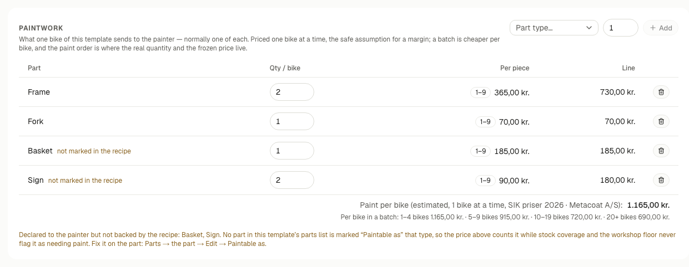
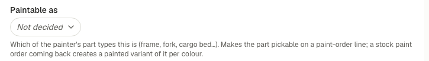

# What to fix in the system — a walk through your real data

**For Dennis, 3 September 2026.** Everything here was read from **production**
today — your live data, not a test copy. Nothing has been changed for you.

Each item says where to click. A path like **Bikes → Bike templates → Jeudan**
means: the group in the left menu, then the page, then the row. Buttons are
named in English here; your login shows Danish, and they sit in the same place.

---

## 1 · One idea first: *"not marked in the recipe"*

You will meet this on a template's **Paintwork** section. It looks like this —
this is your real Jeudan template:

**There are two separate statements about paint, made in two different places.**

| | Where | What it does |
|---|---|---|
| *"One of these sends a frame, a fork and a basket to the painter"* | the template's **Paintwork** section, above | prices the paint job → your **margin** |
| *"`JP-BA26H` is the thing the painter calls a basket"* | **Parts → the part → Edit → Paintable as** | moves the real part → your **stock** |

The first is money. The second is stock. *"Not marked in the recipe"* means you
made the first but not the second, and the effect is sneaky: **the price counts
it, but the workshop never sees it.** Your margin looks right, while coverage
says the bike is fully covered and nobody is told the basket needs painting.

The second statement is made here, on the part itself:

**Two different causes, two different fixes.** Either the part is in the recipe
and nobody marked it — fix it on the part, above. Or **there is no such part in
the recipe at all**, and marking something cannot help: the part has to be added
to the template's parts list first. Both cases are below, and one part doesn't
exist in the system at all.

---

## 2 · Wrong — please fix

**Jeudan says it sends TWO frames to the painter.** A bike has one, every other
template says one, and the recipe holds one. You can see it in the picture
above: *2 × 365,00 = 730,00 kr.* So Jeudan's paint cost reads **1.165,00 kr.
instead of 800,00** — 365 kr. per bike of cost that isn't real.
→ **Bikes → Bike templates → Jeudan → Paintwork**, change the 2 to a 1.

**Five paint lines have no part behind them**, across three templates:

| Template | Declares | What the recipe has | What to do |
|---|---|---|---|
| Jeudan | Basket ×1 | `JP-BA26H` Alloy basket hotel model | **Is this the one that gets painted?** If yes, mark it |
| Jeudan | Sign ×2 | nothing | **no sign part exists at all** — one must be created |
| Svajer classic | Sign ×1 | nothing | same |
| Svajer cargo F 350 | Sign ×1 | nothing | same |
| Svajer cargo F 350 | Fork ×1 | **no fork in the recipe** | add the fork to the parts list |

→ **Bikes → Bike templates → [the template] → Paintwork** to see the amber note;
→ **Parts → All parts → [the part] → Edit → Paintable as** to fix the marking.

**Three templates send nothing to the painter, but their parts say otherwise.**
`Norma CS`, `Norma FS` and `Svajer F` declare no paintwork at all, yet their
recipes hold parts already marked paintable (2, 2 and **4**). Their
cost-to-produce shows **no paint cost**, so the margin on them is overstated.
`Svajer F` is the one you have been quoting from.
→ **Bikes → Bike templates → [the template] → Paintwork → Add**.

**A colour contradicts itself.** The colour named **"RAL 5013"** carries the RAL
code **2150**. RAL 5013 is a blue; 2150 is not a RAL code at all. One of the two
is wrong, and this colour is on two production orders.
→ **Admin → Lists → Colours**.

**Red and Purple have no RAL code**, so the painter cannot reproduce them and
the price list cannot match them. Same place.

**A test bike is in your real stock**: frame number `Jp -test 1`, *in stock*,
built on MO-2026-0014. It counts as a bike you own.
→ **Bikes → All bikes**, search `test`.

**93 "test" displays count as real stock.** `JP-AND-DSP-NTC` — both stock
entries have the reason written as just *"test"*, about **26.000 kr.** at the
recorded cost. Real, or should they come off?

---

## 3 · Your call — nobody else can decide these

**Two mudguard sets are undecided.** Everything points to **Not painted**:
`JP-Ni42` is polished stainless and no current template uses it; `JP-SKSA46` is
SKS bought black, and the four templates using it declare no mudguard paintwork.
Marking them closes the category so a future bulk action can't sweep them up.

**Six baskets are undecided**, but two obviously never see a painter — `JP-JB01`
is a bag, `JP-CO40` a reflective cover. The real question is only `JP-BA26H` and
`JP-BasJen`.

**Two templates are priced very differently from the rest.** Jeudan sells at
5.000 kr. against 2.166 kr. of parts; Svajer classic at 10.000 against 2.922 —
where the Normas and Svajer C sit at 16–19.200. Right, or a placeholder nobody
revisited?

---

## 4 · Blanks that quietly change the numbers

Not broken — blanks that make the app answer conservatively.

- **169 of 172 parts have no origin** (EU / outside EU), so every new purchase
  line assumes **no import duty**.
- **11 parts have no HS code** → 0 % duty frozen onto any purchase of them.
  Three are in stock: `JP-BasJen` (499), `JP-SP207-27,2 350` (297),
  `JP-AND-DSP-NTC` (93). Check with the customs broker first — two codes carry
  **48,5 % anti-dumping** and six parts already sit on them.
- **`JP-BasJen`: 499 baskets with no cost at all**, counted in stock and valued
  at zero. An estimate beats nothing.
- **166 supplier prices missing** → a drafted purchase order comes out at 0 kr.
- **No part has a reorder point**, so every low-stock warning runs off a rule of
  thumb (at or below 20 % of the last purchase quantity).
- **17 active suppliers have no e-mail**, so you cannot send them an order.

---

## 5 · Loose ends to close

- **PNT-2026-0008** — a paint order left *planned* since 1 September, **no
  colour chosen**, five lines naming no part. Finish or cancel it.
- **MO-2026-0015** — *planned* since 28 July: 4 planned, 1 built, 3 bikes still
  sitting in planning.
- **PO-2026-0059** — placed with Shimano Nordic on 17 June, never received.
- **PO-2026-0060**, **PO-2026-0063** — June and July drafts with no lines.

---

## 6 · Know this, nothing to do

- **Your paint shelf is empty, and that is correct.** No painted stock exists in
  production yet. PNT-2026-0005 did come back in July, but it predates the
  painted-stock feature so it created none. The shelf fills from your next paint
  order.
- **Coverage will start saying a bike needs paint.** Now that frames and forks
  are marked, an order that used to say "all covered" will say *"N parts need
  paint"* — and block the build until they return. That is it working.
- **Metacoat's e-mail is still Nazar's test address**, deliberately, until the
  flow has run for real once.
- **Total stock value reads about 2.545.000 kr.**, not counting those 499
  baskets at zero.
